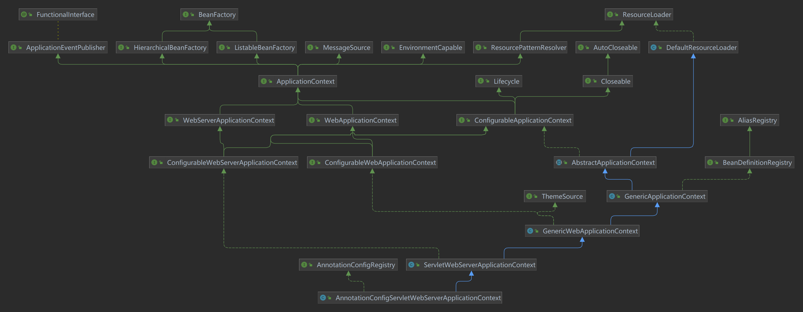

# SpringBoot 启动流程

```java
public static ConfigurableApplicationContext run(Class<?>[]primarySources,String[]args){
        // 两件事：1、初始化SpringApplication 2、执行run方法
        return new SpringApplication(primarySources).run(args);
}
```

## 初始化SpringApplication
1. 读取`SpringBootMyTestApplication`类的所有信息
2. 推断当前SpringBoot应用类型是 `WebApplicationType.SERVLET` 还是 `WebApplicationType.REACTIVE`
3. 初始化`classpath`下 `META-INF/spring.factories` 中已配置得 `ApplicationContextInitializer`
4. 初始化`classpath`下所有已配置得 `ApplicationListener`
5. 根据调用栈，推断出 main 方法得类名
> 如何根据调用栈判断得？

## 执行run方法

1. 初始化`classpath`下 `META-INF/spring.factories` 中已配置得 `SpringApplicationRunListener`
2. 构建应用上下文
- 获取`初始化SpringApplication`时配置的`WebApplicationType`

- 配置 `environment` 系统环境，配置`configureProfiles`激活文件

        public static final String ACTIVE_PROFILES_PROPERTY_NAME = "spring.profiles.active";

 - 获取`systemEnvironment`配置的系统变量`SystemEnvironmentPropertySource`替换成`OriginAwareSystemEnvironmentPropertySource`,
`ConfigFileApplicationListener`加载项目配置文件的监听器，获取配置文件

3. 初始化上下文
创建 `AnnotationConfigServletWebServerApplicationContext` **Context**上下文时，`IOC容器`也进行了创建，`IOC容器`的本质就是`org.springframework.beans.factory.support.DefalutListableBeanFactory`



4. 刷新应用上下文的准备阶段

注册bean的流程

> Spring容器在启动的时候，会将类解析成Spring内部的beanDefinition,并将beanDefinition存储到org.springframework.beans.factory.support.DefalutListableBeanFactory的Map中

> ((DefaultListableBeanFactory)((AnnotationConfigServletWebServerApplicationContext)context).beanFactory).beanDefinitionMap

下面就是一个启动类Bean的详细信息
> springBootMyTestApplication -> {AnnotatedGenericBeanDefinition@4533} 
"Generic bean: class [com.example.springbootmytest.SpringBootMyTestApplication]; scope=singleton; abstract=false; lazyInit=null; autowireMode=0; dependencyCheck=0; autowireCandidate=true; primary=false; factoryBeanName=null; factoryMethodName=null; initMethodName=null; destroyMethodName=null"

> SpringBoot自动化配置原理？

5. 刷新上下文（`Ioc`容器初始化过程的三个步骤）

（1）、Resource定位    

（2）、BeanDefinition的载入     

（3）、注册BeanDefinition


> 如何解析包含 @ComponentScan @Import 等等？

刷新`BeanFactory`,获取`ConfigurableListableBeanFactory`注册`Bean`的工厂
`org.springframework.beans.factory.config.ConfigurableListableBeanFactory.java`
`postProcessBeanDefinitionRegistry`

判断`ConfigurableListableBeanFactory`是否是`BeanDefinitionRegistry`的子类，`ConfigurableListableBeanFactory`强转成`BeanDefinitionRegistry`

从`BeanDefinitionRegistry`中获取`BeanDefinition`,将`BeanDefinitionRegistry`获取到的`BeanDefinition`加载到`List<BeanDefinitionHolder>`中

判断`BeanDefinitionRegistry`是否是`SingletonBeanRegistry`的子类 -> 将 `BeanDefinitionRegistry`强转成`SingletonBeanRegistry`

随后将`List<BeanDefinitionHolder>`转换成`Set<BeanDefinitionHolder>`

解析`Set<BeanDefinitionHolder>`，判断`BeanDefinitionHolder`是否是`AnnotatedBeanDefinition`的子类 -> 将 `BeanDefinitionHolder`强转成`AnnotatedBeanDefinition`,并获取`Metadata`,即为`AnnotationMetadata`

将`AnnotationMetadata`初始化为`ConfigurationClass`,从`ConfigurationClass`获取的`Metadata`作为`SourceClass`去解析

`org.springframework.context.annotation.ConfigurationClassParser`的`doProcessConfigurationClass`

判断类中是否包含`@Component`、`@PropertySources`、`@ComponentScan`、`@Import`等


